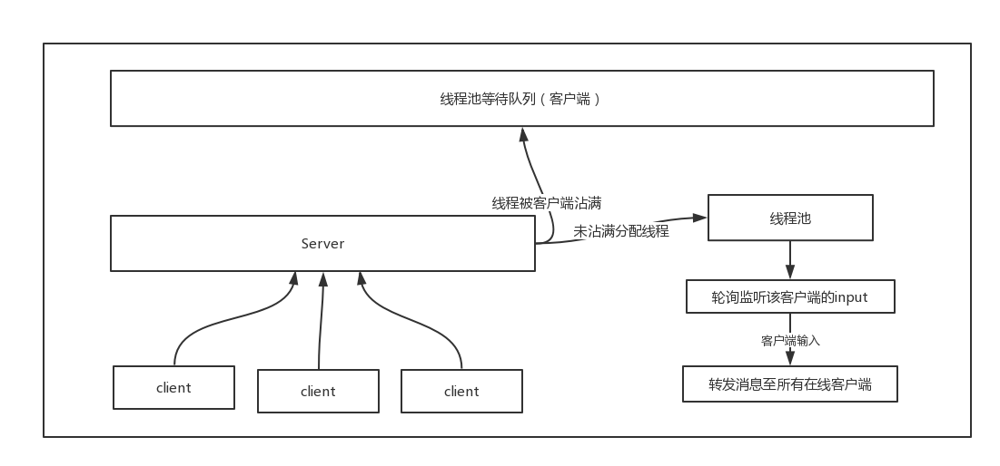
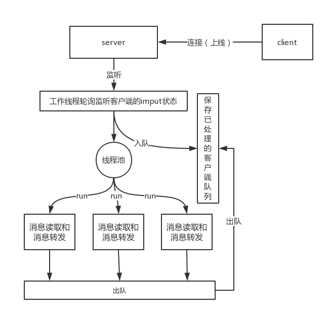

# IO-BIO聊天室升级版
## [存在的问题](https://blog.csdn.net/qq_22271479/article/details/86377404)

## 新思路


## 该架构的优点
1. 解决了之前版本在线程池达到最大线程数的时候，服务端将不能在处理新加入的客户端，除非客户端掉线，线程才有机会去处理。
2. 该版本支持大规模的客户端在线服务。
3. 通过接管了客户端input监听，能更好控制线程数，维持机器的良好新能，可控。

## 项目架构
### Server
*   AbstractBioServer
    * BioServer
    * BioServerSupper
    
#### AbstractBioServer

是Server的抽象类，实现了基础的一些操作，规定了需要子类实现的一些方法。

```java
package com.yzz.chartroom.server;

import com.yzz.chartroom.protocol.Message;

import java.io.IOException;
import java.net.InetAddress;
import java.net.ServerSocket;
import java.net.Socket;
import java.util.concurrent.ConcurrentLinkedQueue;
import java.util.logging.Level;
import java.util.logging.Logger;

/**
 * describe:
 * E-mail:yzzstyle@163.com  date:2019/1/13
 *
 * @Since 0.0.1
 */
public abstract class AbstractBioServer {
    //默认端口
    public static final int DEFAULT_PORT = 8080;

    //默认地址
    public static final String DEFAULT_LOCATION = "127.0.0.1";

    //客户端连接(socket连接)的队列最大长度
    public static final int DEFAULT_BACKLOG = 50;

    //服务端口
    protected final int port;

    //连接队列的最大长度
    protected final int backlog;

    //地址
    protected final String location;

    //Socket监听服务对象
    protected ServerSocket serverSocket;

    //Socket服务监听地址包装类
    protected InetAddress inetAddress;

    //这是一个线程安全的非阻塞的队列
    protected volatile  ConcurrentLinkedQueue<Socket> clientSockets = new ConcurrentLinkedQueue<>();

    //日志
    protected Logger logger = Logger.getLogger(this.getClass().getName());

    protected AbstractBioServer(int port, int backlog, String location) throws IOException {
        this.port = port;
        this.backlog = backlog;
        this.location = location;
        inetAddress = InetAddress.getByName(location);
        //创建一个端口监听对象，监听客户端连接，此刻服务端已经就绪
        serverSocket = new ServerSocket(port, backlog, inetAddress);
        logger.log(Level.INFO, "BIO server has started in " + location + " listening port " + port);
    }

    /**
     * 清除资源 从队列中去移除
     *
     * @param client
     */
    public void remove(Socket client) {
        try {
            boolean result = clientSockets.remove(client);
            if (result && client != null && !client.isClosed()) {
                //关闭连接
                client.close();
                logger.log(Level.WARNING, "移除client" + client.getInetAddress().getHostAddress() + ":" + client.getPort());
            }
        } catch (IOException e) {
            e.printStackTrace();
            logger.log(Level.WARNING, e.getMessage());
        }
    }

    /**
     * 监听客户端连接
     *
     * @throws IOException
     */
    protected abstract void listen() throws IOException;

    /**
     * 提供客户端消息服务
     *
     * @param client
     */
    protected abstract void provideService(Socket client);

    /**
     * 获取客户端消息
     *
     * @param client
     * @return
     * @throws IOException
     */
    protected abstract Message readRequest(Socket client) throws IOException;

    /**
     * 转发客户端消息
     *
     * @param message
     */
    protected abstract void dispatch(Message message);
}

```
#### BioServer
是上一个版本的实现类,通过为每个客户端分配线程实现客户端监听
```java
package com.yzz.chartroom.server;

import com.yzz.chartroom.protocol.BioChartRoomProtocol;
import com.yzz.chartroom.protocol.Message;

import java.io.IOException;
import java.io.InputStream;
import java.net.Socket;
import java.util.Iterator;
import java.util.concurrent.Executor;
import java.util.concurrent.Executors;
import java.util.logging.Level;
import java.util.logging.Logger;

/**
 * describe: 聊天室服务端
 * E-mail:yzzstyle@163.com  date:2019/1/12
 * 你可以简单的这样去启动一个服务端
 *
 * @Since 0.0.1
 * <p>
 * public class Server {
 * public static void main(String[] args) {
 * try {
 * BioServer bioServer = BioServer.newServerByPort(9090);
 * bioServer.listen();
 * } catch (Exception e) {
 * e.printStackTrace();
 * }
 * }
 * }
 */
public class BioServer extends AbstractBioServer {

    //线程池，用于执行接收客户端消息并转发消息至所有在线的客户端，这里最大可以接收10 + Integer.MAX_VALUE 个客户端
    private final Executor pool = Executors.newFixedThreadPool(1);

    /**
     * 创建一个默认的聊天室服务端
     *
     * @return
     * @throws IOException
     */
    public static BioServer createServerByDefault() throws IOException {
        return new BioServer(DEFAULT_PORT, DEFAULT_BACKLOG, DEFAULT_LOCATION);
    }

    /**
     * 创建一个自定义端口的服务端
     *
     * @param port
     * @return
     * @throws IOException
     */
    public static BioServer newServerByPort(int port) throws IOException {
        return new BioServer(port, DEFAULT_BACKLOG, DEFAULT_LOCATION);
    }

    /**
     * 创建一个自定义端口和连接队列深度的服务
     *
     * @param port    端口
     * @param logback 连接队列最大num
     * @return
     * @throws IOException
     */
    public static BioServer newServerWithDefaultLocation(int port, int logback) throws IOException {
        return new BioServer(port, logback, DEFAULT_LOCATION);
    }

    /**
     * 自定义端口、连接大小、地址的服务端对象
     *
     * @param port
     * @param logback
     * @param location
     * @return
     * @throws IOException
     */
    public static BioServer newServerDynamic(int port, int logback, String location) throws IOException {
        return new BioServer(port, logback, location);
    }

    /**
     * @param port     监听的端口号
     * @param backlog  客户端连接的队列最大长度
     * @param location 地址
     * @throws IOException
     */
    protected BioServer(int port, int backlog, String location) throws IOException {
        super(port, backlog, location);
    }

    /**
     * accept 监听客户端的连接
     * 1. accept()获取客户端Socket
     * 2. provideService（）提供处理客户端消息的服务
     *
     * @throws IOException
     */
    @Override
    public void listen() throws IOException {
        while (true) {
            Socket client = serverSocket.accept();
            clientSockets.add(client);
            logger.log(Level.INFO, client.getInetAddress().getHostAddress() + "加入了聊天室");
            logger.log(Level.INFO, "当前在线人数：" + clientSockets.size());
            pool.execute(() -> provideService(client));
        }
    }

    /**
     * 提供服务 轮询去客户端处理消息
     *
     * @param client
     */
    @Override
    protected void provideService(Socket client) {
        while (true) {
            //自定义协议 消息对象
            Message message = null;
            try {
                //1. 获取客户端发送至服务端的消息
                message = readRequest(client);
                //1.如果客户端队列的size为0，就说明所有客户端都已经下线，直接结束轮询
                if (clientSockets.size() == 0) {
                    break;
                } else {
                    //转发消息至所有客户端
                    dispatch(message);
                }
            } catch (IOException e) {
                //这里的异常表示客户端已经下线，此时需要去清除客户端连接资源
                logger.log(Level.WARNING, e.getMessage());
                remove(client);
                break;
            }
        }
    }

    /**
     * 读取客户端发送来的消息
     *
     * @param client 客户端Socket
     * @return
     * @throws IOException
     */
    @Override
    protected Message readRequest(Socket client) throws IOException {
        InputStream in = client.getInputStream();
        //自定义协议负责去解析消息
        return BioChartRoomProtocol.getInstance().parse(in);
    }

    /**
     * 转发请求至所有客户端
     *
     * @param message
     */
    @Override
    protected void dispatch(Message message) {
        Iterator<Socket> clients = clientSockets.iterator();
        Socket client = null;
        //遍历发送至客户端，该方法是同步方法，so，客户端收到的消息是先后顺序和其进入聊天室的顺序是一致的
        while (clients.hasNext()) {
            try {
                client = clients.next();
                logger.log(Level.INFO, "转发消息至" + message.getHeader().toString());
                //协议去写入消息至客户端
                BioChartRoomProtocol.getInstance().write(client.getOutputStream(), message);
            } catch (IOException e) {
                //这里的异常表示客户端已经下线，此时需要去清除客户端连接资源
                e.printStackTrace();
                logger.log(Level.INFO, e.getMessage());
                remove(client);
            }
        }
    }

}

```
#### BioServerSupper
该类是第二版，通过一条工作线程去轮询监听客户端输入状态，通过线程池并发去转发消息。
```java
package com.yzz.chartroom.server;

import com.yzz.chartroom.protocol.BioChartRoomProtocolSupper;
import com.yzz.chartroom.protocol.Message;

import java.io.IOException;
import java.io.InputStream;
import java.net.Socket;
import java.util.Iterator;
import java.util.concurrent.*;
import java.util.logging.Level;

/**
 * describe: 聊天室服务端
 * E-mail:yzzstyle@163.com  date:2019/1/12
 * 你可以简单的这样去启动一个服务端
 *
 * @Since 0.0.1
 * <p>
 * public class Server {
 * public static void main(String[] args) {
 * try {
 * BioServer bioServer = BioServer.newServerByPort(9090);
 * bioServer.listen();
 * } catch (Exception e) {
 * e.printStackTrace();
 * }
 * }
 * }
 */
public class BioServerSupper extends AbstractBioServer {

    private final int core = Runtime.getRuntime().availableProcessors();

    //循环监听线程
    private final ThreadPoolExecutor providerPool = new ThreadPoolExecutor(core, core, 2, TimeUnit.SECONDS, new LinkedBlockingDeque<>());

    //等待队列
    private volatile ConcurrentLinkedQueue<Socket> waitQueue = new ConcurrentLinkedQueue();


    //处理消息线程池
    private ExecutorService handelMessagePool = Executors.newFixedThreadPool(Runtime.getRuntime().availableProcessors());

    /**
     * 创建一个默认的聊天室服务端
     *
     * @return
     * @throws IOException
     */
    public static BioServer createServerByDefault() throws IOException {
        return new BioServer(DEFAULT_PORT, DEFAULT_BACKLOG, DEFAULT_LOCATION);
    }

    /**
     * 创建一个自定义端口的服务端
     *
     * @param port
     * @return
     * @throws IOException
     */
    public static BioServerSupper newServerByPort(int port) throws IOException {
        return new BioServerSupper(port, DEFAULT_BACKLOG, DEFAULT_LOCATION);
    }

    /**
     * 创建一个自定义端口和连接队列深度的服务
     *
     * @param port    端口
     * @param logback 连接队列最大num
     * @return
     * @throws IOException
     */
    public static BioServerSupper newServerWithDefaultLocation(int port, int logback) throws IOException {
        return new BioServerSupper(port, logback, DEFAULT_LOCATION);
    }

    /**
     * 自定义端口、连接大小、地址的服务端对象
     *
     * @param port
     * @param logback
     * @param location
     * @return
     * @throws IOException
     */
    public static BioServerSupper newServerDynamic(int port, int logback, String location) throws IOException {
        return new BioServerSupper(port, logback, location);
    }

    protected BioServerSupper(int port, int backlog, String location) throws IOException {
        super(port, backlog, location);
    }

    /**
     * 轮询监听客户端输入
     */
    public void loopClientForProviderServer() {
        providerPool.execute(
                () -> {
                    while (true) {
                        Socket[] clients = new Socket[clientSockets.size()];
                        //监听
                        listenClientInputStatus(clientSockets.toArray(clients));
                    }
                }
        );
    }

    /**
     * 监听客户端输入状态
     *
     * @param clients
     */
    public void listenClientInputStatus(Socket[] clients) {
        for (Socket client : clients) {
            if (!clientIsOk(client)) {
                remove(client);
                continue;
            }
            if (waitQueue.contains(client)) {
                continue;
            }
            try {
                InputStream inputStream = client.getInputStream();
                if (inputStream.available() > 0) {
                    //如果有消息，则加入等待处理的队列，一旦加入不可重复消费
                    waitQueue.add(client);
                    //提供转发服务
                    provideService(client);
                }
            } catch (IOException e) {
                logger.log(Level.WARNING, e.getMessage());
                remove(client);
            }
        }
    }

    /**
     * 判断客户端是否有效
     *
     * @param client
     * @return
     */
    public boolean clientIsOk(Socket client) {
        if (client == null || client.isClosed() || client.isInputShutdown() || client.isOutputShutdown()) {
            return false;
        }
        return true;
    }

    /**
     * 监听，服务的入口
     *
     * @throws IOException
     */
    @Override
    public void listen() throws IOException {
        //开启监听客户端的消息流状态
        loopClientForProviderServer();
        //轮询监听
        while (true) {
            Socket client = serverSocket.accept();
            clientSockets.add(client);
            logger.log(Level.INFO, client.getInetAddress().getHostAddress() + "加入了supper聊天室");
            logger.log(Level.INFO, "当前在线人数：" + clientSockets.size());
        }
    }


    /**
     * 提供妆发服务
     *
     * @param client
     */
    @Override
    protected void provideService(Socket client) {
        handelMessagePool.execute(() -> {
            //检查
            if (!clientIsOk(client)) {
                return;
            }
            try {
                //获取客户端的消息
                Message message = readRequest(client);
                if (message == null) {
                    return;
                }
                if (client != null) {
                    //出队，任务消息转发完毕，可再次提供服务
                    waitQueue.remove(client);
                }
                //转发客户端的消息
                dispatch(message);
            } catch (IOException e) {
                e.printStackTrace();
                logger.log(Level.WARNING, e.getMessage());
                remove(client);
            }
        });
    }

    @Override
    protected Message readRequest(Socket client) throws IOException {
        InputStream in = client.getInputStream();
        //自定义协议负责去解析消息
        return BioChartRoomProtocolSupper.getInstance().parse(in);
    }

    @Override
    protected void dispatch(Message message) {
        Iterator<Socket> clients = clientSockets.iterator();
        Socket client = null;
        //遍历发送至客户端，该方法是同步方法，so，客户端收到的消息是先后顺序和其进入聊天室的顺序是一致的
        while (clients.hasNext()) {
            try {
                client = clients.next();
                logger.log(Level.INFO, Thread.currentThread().getName() + "->转发消息至" + client.getInetAddress().getHostAddress() + ":" + client.getPort());
                //协议去写入消息至客户端
                if (clientIsOk(client)) {
                    BioChartRoomProtocolSupper.getInstance().write(client.getOutputStream(), message);
                }
            } catch (IOException e) {
                //这里的异常表示客户端已经下线，此时需要去清除客户端连接资源
                e.printStackTrace();
                logger.log(Level.INFO, e.getMessage());
                remove(client);
            }
        }
    }
}

```
### client
客户端和上篇一样，客户端不必做更改

### 项目地址
https://github.com/yinzhongzheng/bio-chartroom
```
git clone https://github.com/yinzhongzheng/bio-chartroom.git
```