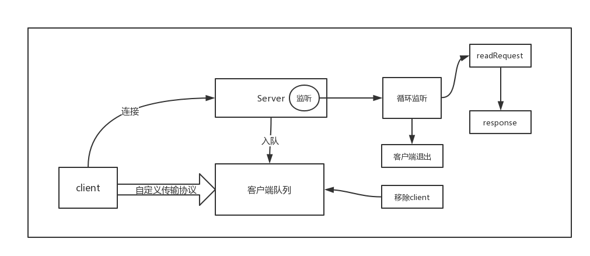
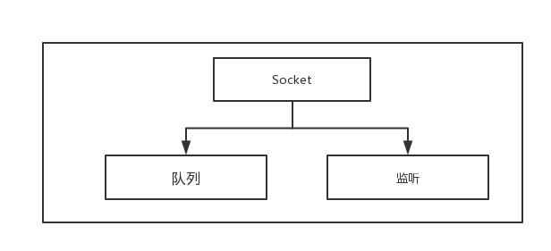
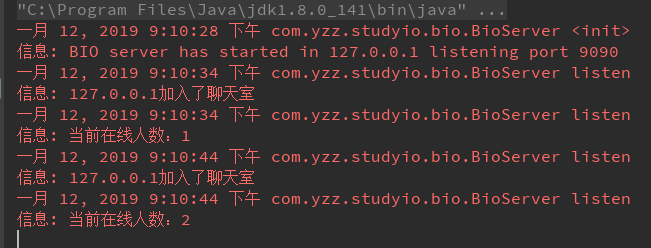
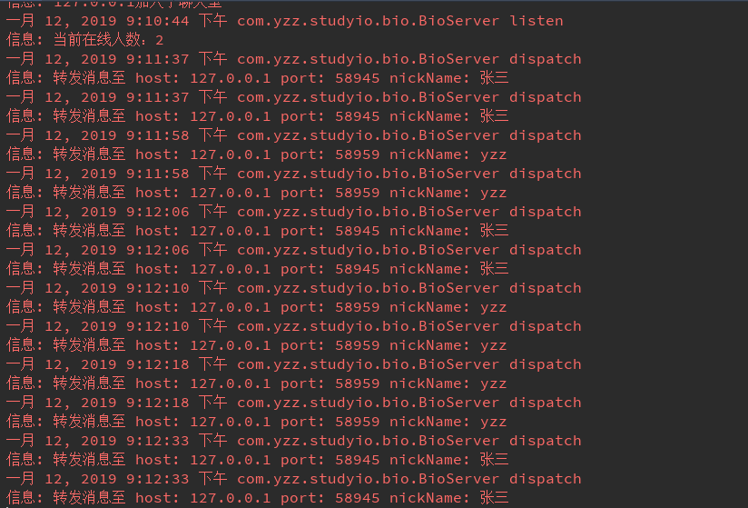
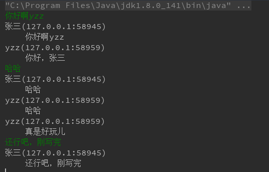
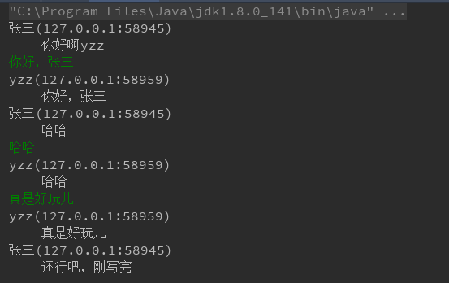

# IO-BIO实现聊天室(Socket全双工)
## 概述
本次实现的是一个聊天室，使用的是TCP/IP协议，使用自定义传输协议。多个客户端连接上服务端，客户端发送消息到服务端，服务端将客户端加入到客户端队列，通过loop队列，向所有的客户端转发消息。此处转发为同步转发，意味着先加入的客户端将优先收到消息。当客户端离线的时候，服务端将从队列中移除，并且终止针对该客户端的轮询。
## 流程图

## 服务端

1. 获取客户端连接
2. 将客户端Socket放入线程安全的非阻塞队列
3. 一个客户端提供一个线程去相互通信
### 具体实现
```java
package com.yzz.studyio.bio;

import com.yzz.studyio.bio.protocol.BioChartRoomProtocol;
import com.yzz.studyio.bio.protocol.Message;

import java.io.IOException;
import java.io.InputStream;
import java.net.InetAddress;
import java.net.ServerSocket;
import java.net.Socket;
import java.util.Iterator;
import java.util.concurrent.ConcurrentLinkedQueue;
import java.util.concurrent.Executor;
import java.util.concurrent.Executors;
import java.util.logging.Level;
import java.util.logging.Logger;

/**
 * describe: 聊天室服务端
 * E-mail:yzzstyle@163.com  date:2019/1/12
 * 你可以简单的这样去启动一个服务端
 * @Since 0.0.1
 *
 *   public class Server {
 *       public static void main(String[] args) {
 *           try {
 *               BioServer bioServer = BioServer.newServerByPort(9090);
 *               bioServer.listen();
 *           } catch (Exception e) {
 *               e.printStackTrace();
 *           }
 *       }
 *   }
 */
public class BioServer {

    //默认端口
    public static final int DEFAULT_PORT = 8080;

    //默认地址
    public static final String DEFAULT_LOCATION = "127.0.0.1";

    //客户端连接(socket连接)的队列最大长度
    public static final int DEFAULT_BACKLOG = 50;

    //日志
    private final Logger logger = Logger.getLogger(BioServer.class.getName());

    //线程池，用于执行接收客户端消息并转发消息至所有在线的客户端，这里最大可以接收10 + Integer.MAX_VALUE 个客户端
    private final Executor pool = Executors.newFixedThreadPool(10);

    //服务端口
    private final int port;

    //连接队列的最大长度
    private final int backlog;

    //地址
    private final String location;

    //Socket监听服务对象
    private ServerSocket serverSocket;

    //Socket服务监听地址包装类
    private InetAddress inetAddress;

    //这是一个线程安全的非阻塞的队列
    private final ConcurrentLinkedQueue<Socket> clientSockets = new ConcurrentLinkedQueue<>();

    /**
     * 创建一个默认的聊天室服务端
     *
     * @return
     * @throws IOException
     */
    public static BioServer createServerByDefault() throws IOException {
        return new BioServer(DEFAULT_PORT, DEFAULT_BACKLOG, DEFAULT_LOCATION);
    }

    /**
     * 创建一个自定义端口的服务端
     *
     * @param port
     * @return
     * @throws IOException
     */
    public static BioServer newServerByPort(int port) throws IOException {
        return new BioServer(port, DEFAULT_BACKLOG, DEFAULT_LOCATION);
    }

    /**
     * 创建一个自定义端口和连接队列深度的服务
     *
     * @param port    端口
     * @param logback 连接队列最大num
     * @return
     * @throws IOException
     */
    public static BioServer newServerWithDefaultLocation(int port, int logback) throws IOException {
        return new BioServer(port, logback, DEFAULT_LOCATION);
    }

    /**
     * 自定义端口、连接大小、地址的服务端对象
     *
     * @param port
     * @param logback
     * @param location
     * @return
     * @throws IOException
     */
    public static BioServer newServerDynamic(int port, int logback, String location) throws IOException {
        return new BioServer(port, logback, location);
    }

    /**
     * @param port     监听的端口号
     * @param backlog  客户端连接的队列最大长度
     * @param location 地址
     * @throws IOException
     */
    private BioServer(int port, int backlog, String location) throws IOException {
        this.port = port;
        this.location = location;
        this.backlog = backlog;
        inetAddress = InetAddress.getByName(location);
        //创建一个端口监听对象，监听客户端连接，此刻服务端已经就绪
        serverSocket = new ServerSocket(port, backlog, inetAddress);
        logger.log(Level.INFO, "BIO server has started in " + location + " listening port " + port);
    }

    /**
     * accept 监听客户端的连接
     * 1. accept()获取客户端Socket
     * 2. provideService（）提供处理客户端消息的服务
     *
     * @throws IOException
     */
    public void listen() throws IOException {
        while (true) {
            Socket client = serverSocket.accept();
            clientSockets.add(client);
            logger.log(Level.INFO, client.getInetAddress().getHostAddress() + "加入了聊天室");
            logger.log(Level.INFO, "当前在线人数：" + clientSockets.size());
            pool.execute(() -> provideService(client));
        }
    }

    /**
     * 提供服务 轮询去客户端处理消息
     *
     * @param client
     */
    public void provideService(Socket client) {
        while (true) {
            //自定义协议 消息对象
            Message message = null;
            try {
                //1. 获取客户端发送至服务端的消息
                message = readRequest(client);
                //1.如果客户端队列的size为0，就说明所有客户端都已经下线，直接结束轮询
                if (clientSockets.size() == 0) {
                    break;
                } else {
                    //转发消息至所有客户端
                    dispatch(message);
                }
            } catch (IOException e) {
                //这里的异常表示客户端已经下线，此时需要去清除客户端连接资源
                logger.log(Level.WARNING, e.getMessage());
                remove(client);
                break;
            }
        }
    }

    /**
     * 读取客户端发送来的消息
     *
     * @param client 客户端Socket
     * @return
     * @throws IOException
     */
    public Message readRequest(Socket client) throws IOException {
        InputStream in = client.getInputStream();
        //自定义协议负责去解析消息
        return BioChartRoomProtocol.parse(in);
    }

    /**
     * 转发请求至所有客户端
     *
     * @param message
     */
    public void dispatch(Message message) {
        Iterator<Socket> clients = clientSockets.iterator();
        Socket client = null;
        //遍历发送至客户端，该方法是同步方法，so，客户端收到的消息是先后顺序和其进入聊天室的顺序是一致的
        while (clients.hasNext()) {
            try {
                client = clients.next();
                logger.log(Level.INFO, "转发消息至" + message.getHeader().toString());
                //协议去写入消息至客户端
                BioChartRoomProtocol.write(client.getOutputStream(), message);
            } catch (IOException e) {
                //这里的异常表示客户端已经下线，此时需要去清除客户端连接资源
                e.printStackTrace();
                logger.log(Level.INFO, e.getMessage());
                remove(client);
            }
        }
    }

    /**
     * 清除资源 从队列中去移除
     *
     * @param client
     */
    public void remove(Socket client) {
        try {
            boolean result = clientSockets.remove(client);
            if (result && client != null && !client.isClosed()) {
                //关闭连接
                client.close();
                logger.log(Level.WARNING, "移除client" + client.getInetAddress().getHostAddress() + ":" + client.getPort());
            }
        } catch (IOException e) {
            e.printStackTrace();
            logger.log(Level.WARNING, e.getMessage());
        }
    }

}

```
## 客户端
1. 连接上服务端
2. 开辟线程去轮询接收服务端的消息
3. 用户发送消息至客户端

### 具体实现
```java
package com.yzz.studyio.bio;

import com.yzz.studyio.bio.protocol.BioChartRoomProtocol;
import com.yzz.studyio.bio.protocol.Header;
import com.yzz.studyio.bio.protocol.Message;

import java.io.IOException;
import java.io.InputStream;
import java.io.OutputStream;
import java.net.InetAddress;
import java.net.Socket;
import java.util.concurrent.Executor;
import java.util.concurrent.Executors;
import java.util.logging.Logger;

/**
 * describe:
 * E-mail:yzzstyle@163.com  date:2019/1/12
 * 你可以简单这样测试
 *
 * @Since 0.0.1
 *
 *   public class Client {
 *       public static void main(String[] args) {
 *           try {
 *               Scanner sc = new Scanner(System.in);
 *               BioClient bioClient = new BioClient(9090, "127.0.0.1", args[0]);
 *               bioClient.listen12n(message -> {
 *                   System.out.println(message.toString());
 *               });
 *               while (true) {
 *                   String content = sc.next();
 *                   bioClient.sendMsg(content);
 *               }
 *           } catch (Exception e) {
 *               e.printStackTrace();
 *           }
 *       }
 *   }
*/
public class BioClient {

    //服务端端口
    private final int port;

    //服务端地址
    private final String location;

    //连接服务端的Socket对象
    private Socket socket;

    //创建的一个单线程
    private Executor pool = Executors.newSingleThreadExecutor();

    //用户昵称，必填
    private final String nickName;

    //消息头
    private final Header header;

    //日志
    private Logger logger = Logger.getLogger(BioClient.class.getName());

    /**
     * 该构造初始化了 port、location、nicName 并创建了与服务端通信的Socket连接
     * @param port
     * @param location
     * @param nicName
     * @throws IOException
     */
    public BioClient(int port, String location, String nicName) throws IOException {
        this.port = port;
        this.location = location;
        this.nickName = nicName;
        InetAddress inetAddress = InetAddress.getByName(location);
        socket = new Socket(inetAddress, port);
        header = new Header(inetAddress.getHostAddress(), socket.getLocalPort(), nicName);
    }

    /**
     * 向服务端发送消息
     * @param msg
     * @throws IOException
     */
    public void sendMsg(String msg) throws IOException {
        OutputStream outputStream = socket.getOutputStream();
        //自定义协议去发送消息
        BioChartRoomProtocol.write(outputStream, header, msg);
    }

    /**
     * 从服务端接收消息
     * @return
     * @throws IOException
     */
    public Message getResponse() throws IOException {
        InputStream inputStream = socket.getInputStream();
        //自定义协议去接收消息，返回消息对象
        Message message = BioChartRoomProtocol.parse(inputStream);
        return message;
    }

    /**
     * 清除资源
     */
    public void clear() {
        if (socket != null && !socket.isClosed()) {
            try {
                socket.close();
            } catch (IOException e) {
                e.printStackTrace();
            }
        }
    }

    /**
     * 监听
     * 开辟一个工作线程去接收服务端转发的消息
     * @param callback
     */
    public void listen12n(MSGCallback callback) {
        pool.execute(() -> {
            while (true) {
                try {
                    Message message = getResponse();
                    //该回调面向用户，提供服务端发送的消息
                    callback.message(message);
                } catch (IOException e) {
                    e.printStackTrace();
                    clear();
                    return;
                }
            }
        });

    }

    /**
     * 回调接口
     */
    public interface MSGCallback {
        void message(Message message);
    }
}

```
## 自定义协议
### 组成
* Header 封装消息头
* Message 封装消息 包括消息头和消息体
* BioChartRoomProtocol 负载CS读写
### Header
```java
package com.yzz.studyio.bio.protocol;

import java.io.Serializable;

/**
 * describe: 自定义协议中的消息头
 * E-mail:yzzstyle@163.com  date:2019/1/12
 *
 * @Since 0.0.1
 */
public class Header implements Serializable {

    //消息来源地
    private String host;
    //消息来源地的端口
    private int port;
    //发送消息用户的昵称
    private String nickName;

    public Header(String host, int port, String nickName) {
        this.host = host;
        this.port = port;
        this.nickName = nickName;
    }

    public String getHost() {
        return host;
    }

    public int getPort() {
        return port;
    }

    public String getNickName() {
        return nickName;
    }

    public void setHost(String host) {
        this.host = host;
    }

    public void setPort(int port) {
        this.port = port;
    }

    @Override
    public String toString() {
        return " host: " + host + " port: " + port + " nickName: " + nickName;
    }
}

```
### Message
```jave
package com.yzz.studyio.bio.protocol;

import java.io.Serializable;

/**
 * describe:自定义协议的消息对象，包括消息头和消息体
 * E-mail:yzzstyle@163.com  date:2019/1/12
 *
 * @Since 0.0.1
 */
public class Message implements Serializable {
    private Header header;
    private String message;

    public Message(Header header, String message) {
        this.header = header;
        this.message = message;
    }

    public Header getHeader() {
        return header;
    }

    public void setHeader(Header header) {
        this.header = header;
    }

    public String getMessage() {
        return message;
    }

    public void setMessage(String message) {
        this.message = message;
    }

    @Override
    public String toString() {
        StringBuffer sb = new StringBuffer();
        sb.append(header.getNickName())
                .append("(")
                .append(header.getHost())
                .append(":")
                .append(header.getPort())
                .append(")")
                .append("\r\n")
                .append("\t")
                .append(message);
        return sb.toString();
    }
}

```
### BioChartRoomProtocol
```java
package com.yzz.studyio.bio.protocol;

import java.io.*;

/**
 * describe: 自定义协议的操作类包括 读和写
 * E-mail:yzzstyle@163.com  date:2019/1/12
 * 使用 jdk自带的序列化机制，将Message消息对象作为CS交互的介质
 * @Since 0.0.1
 */
public class BioChartRoomProtocol {

    /**
     * 些消息 适用于客户单发消息
     * @param outputStream
     * @param header
     * @param content
     * @throws IOException
     */
    public static void write(OutputStream outputStream, Header header, String content) throws IOException {
        ObjectOutputStream objectOutputStream = new ObjectOutputStream(outputStream);
        Message message = new Message(header, content);
        objectOutputStream.writeObject(message);
    }

    /***
     * 写消息 使用服务端转发消息
     * @param outputStream
     * @param message
     * @throws IOException
     */
    public static void write(OutputStream outputStream, Message message) throws IOException {
        ObjectOutputStream objectOutputStream = new ObjectOutputStream(outputStream);
        objectOutputStream.writeObject(message);
    }

    /**
     * 读操作，将消息转化成消息对象
     * @param inputStream
     * @return
     * @throws IOException
     */
    public static Message parse(InputStream inputStream) throws IOException {
        ObjectInputStream objectInputStream = new ObjectInputStream(inputStream);
        Message message = null;
        try {
            message = (Message) objectInputStream.readObject();
        } catch (ClassNotFoundException e) {
            throw new Error(e.getMessage());
        }
        return message;
    }

}

```
## 效果图
1. 客户端连接

2. 客户端发送消息，服务端转发

3. 客户端1发送消息

4. 客户端2发送消息


## 总结
1. BIO是阻塞的，接收客户端连接效率不高
2. 这里我才用了线程池去处理没客户端的交互，性能良好.
3. 这里我才用了线程安全的非阻塞队列，线程安全，新能很好
4. 这里要特别注意客户端断开的情况和服务端挂掉的情况，其实关闭资源和中断轮询，否则轮询造成cpu被被沾满，严重情况下会导致机器crash。
5. 这里采用的自定要传输协议，通过jdk序列化机制，通过对象来包装消息。


